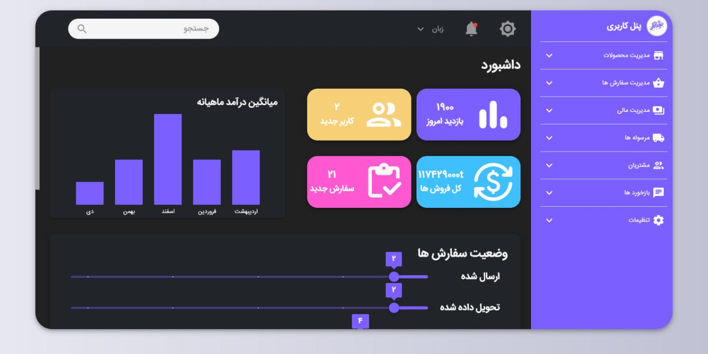
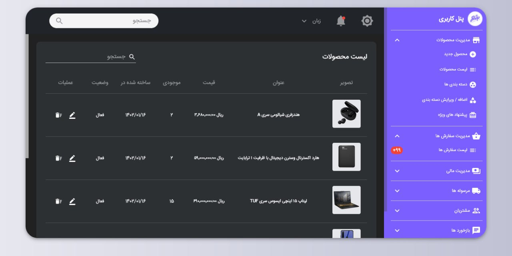

# 🛍️ Shopify Clone - Admin Panel

This is the admin dashboard for the Shopify Clone project, built with React. It provides a user-friendly interface for managing products, viewing orders, and overseeing store operations.

*This admin panel communicates with [Backend](https://github.com/vinixdev/shopify_backend).*

---

### ✨ Features

* **Interactive Dashboard**: At-a-glance view of key store metrics.
* **Product Management**: Easily add, edit, and delete products with a form-based interface.
* **Order Tracking**: View and manage incoming customer orders.

---

### 🛠️ Tech Stack

* **Library**: React.js
* **Routing**: React Router
* **Styling**: Material-UI
* **API Communication**: Axios

---

### 🚀 Getting Started

Follow these instructions to get the admin panel running locally.

**Prerequisites**

* Node.js (v18.x or later)
* npm or yarn
* A running instance of the [backend server](https://github.com/vinixdev/shopify_backend).

**Installation & Setup**

1.  **Clone the repository:**
    ```sh
    git clone [https://github.com/vinixdev/shopify-admin-panel.git](https://github.com/vinixdev/shopify-admin-panel.git)
    cd shopify-admin-panel
    ```

2.  **Install dependencies:**
    ```sh
    npm install
    ```
    
3.  **Run the application:**
    ```sh
    npm start
    ```
    The admin panel will open at `http://localhost:3000`.

---

### 💻️ Screenshots and Demo

* **Dashboard page**:
    
* **Product list**:
    
* **Demo 1**:
    
* **Demo 2**:
    

---
### 🔗 Related Repositories

* **Backend**: [Backend repo](https://github.com/vinixdev/shopify_backend)
* **Frontend**: [Frontend repo](https://github.com/vinixdev/shopify_frontend_next)
